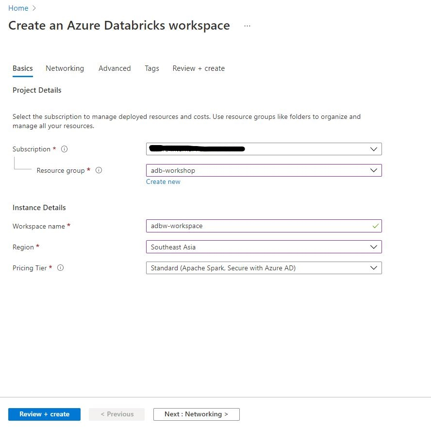
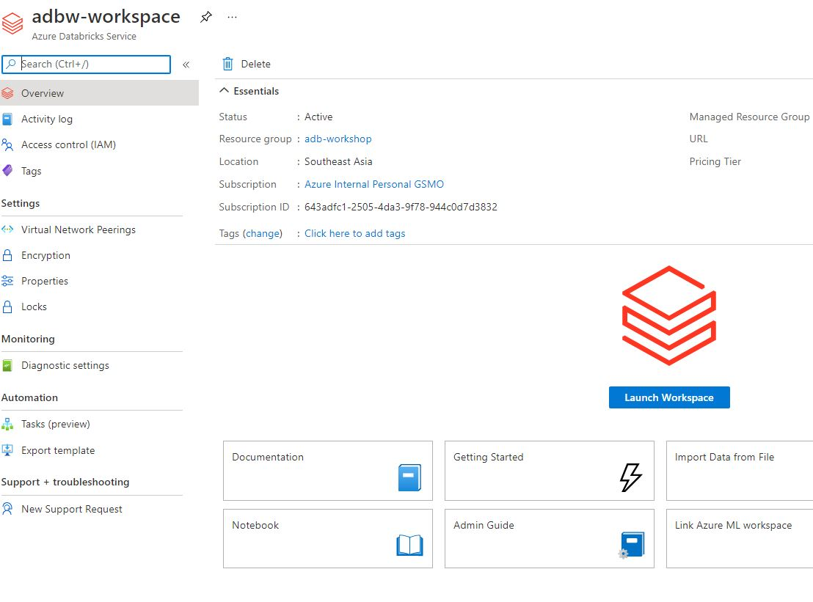
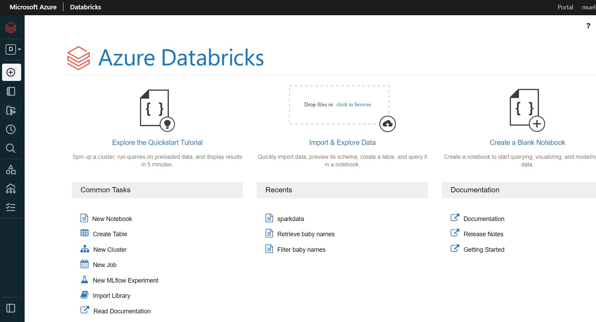
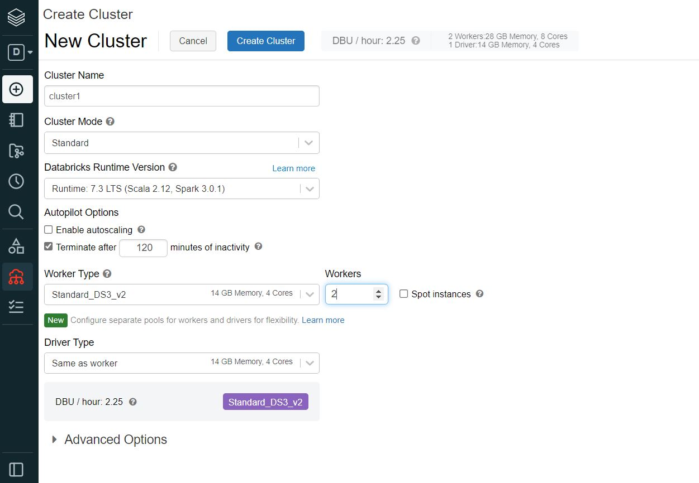
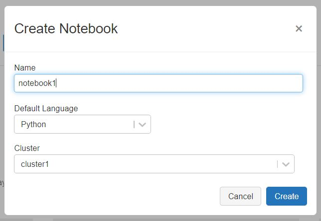
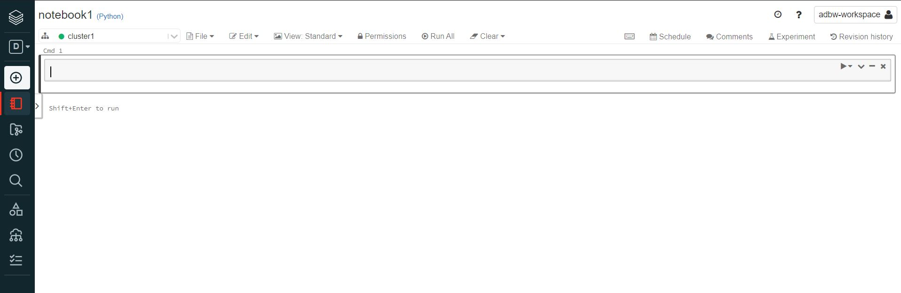
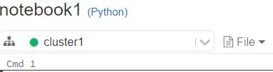

**Contents**

<!-- TOC -->

- [Azure Databricks Data Engineering Workshop](#azure-databricks-data-engineering-workshop)
  - [Abstract and learning objectives](#abstract-and-learning-objectives)
  - [Overview](#overview)
  - [Exercise 1: Setting up Databricks Environment](#exercise-1-setting-up-databricks-environment)
    - [Task 1: Setup Databricks Workspace](#task-1-setup-databricks-workspace)
    - [Task 2: Setup Databricks All Purpose Cluster](#task-2-setup-databricks-cluster)
  - [Exercise 2: Setting up Databricks Notebook](#exercise-2-setting-up-databricks-notebook)
    - [Task 1: Creating the notebook](#task-1-creating-the-notebook)
    - [Task 2: Testing out the notebook](#task-2-testing-out-the-notebook)
  - [Exercise 3: Understanding RDD](#exercise-3-understanding-rdd)
    - [Task 1: Handson RDD ](#task-1-handson-rdd)
  - [Exercise 4: Understanding Dataframe](#exercise-4-understanding-dataframe)
    - [Task 1: Handson Dataframe ](#task-1-handson-rdd)
  - [Exercise 5: Understanding Dataset](#exercise-3-understanding-dataset)
    - [Task 1: Handson Dataset ](#task-1-handson-dataset)
  - [Exercise 6: ETL with Databricks](#exercise-6-etl-with-databricks)
    - [Task 1: Setting Azure Data Factory ](#task-1-setting-up-azure-data-factory)
    - [Task 2: Creating the ETL pipeline ](#task-1-setting-up-azure-data-factory)
  <!-- /TOC -->

# Azure Databricks Data Engineering Workshop
todo

## Overview
todo

## Exercise 1: Setting up Databricks Environment
In this exercise, you will learn how to create your Databricks workspace and setting up the cluster.

### Task 1: Setup Databricks Workspace
1. Navigate to azure portal.
2. Navigate to Azure Databricks Page via menu or you can type on the search bar.
3. Click Create button.
4. Fill the information needed to create the workspace as shown below.

5. Leave the rest as default.
6. Click Review & Create.

### Task 2: Setup Databricks All Purpose Cluster
1. Navigate to Azure Databricks Page.
2. Select Databricks workspace that you just create.
3. Click launch workspace. This will open a new window that will show the Azure Databricks dashboard.

4. Select new cluster.

5. Fill in cluster configuration.

## Exercise 2: Setting up Databricks Notebook
In this exercise we will learn how to create the notebook and familiarize ourself with the notebook functionality.

### Task 1: Creating the notebook
1. Hover to the left sidebar menu.
2. Select Create then select Notebook.

3. Fill in the name of the notebook, runtime, and the target cluster where the notebook will run.

4. Even if we choose python as the runtime at the beginning, we can change the runtime using % directive later in the cell.
5. Click create then will be shown with the notebook interface we just created.

### Task 2: Testing out the notebook
1. Make sure to check the notebook is attached to an active clustered indicated with green dot.

2. We might need to start the cluster if it is in inactive state.
3. Try to run the following code to test the runtime.
`print("Hello World")`

## Exercise 3: Understanding RDD
todo

### Task 1: Handson RDD
todo

## Exercise 4: Understanding Dataframe
todo

### Task 1: Handson Dataframe
todo

## Exercise 5: Understanding Dataset
todo

### Task 1: Handson Dataset
todo

## Exercise 6: ETL with Databricks
todo

### Task 1: Setting Azure Data Factory
todo

### Task 2: Creating the ETL pipeline
todo