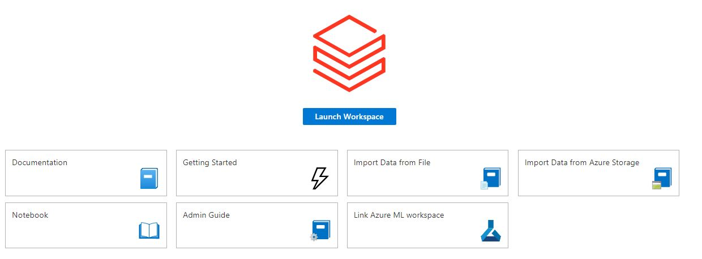
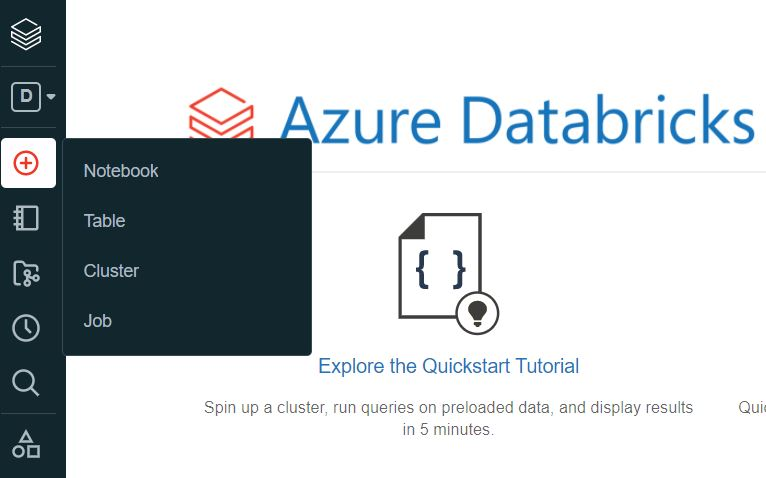

**Contents**

<!-- TOC -->

- [Azure Databricks Data Engineering Workshop](#azure-databricks-data-engineering-workshop)
  - [Abstract and learning objectives](#abstract-and-learning-objectives)
  - [Overview](#overview)
  - [Exercise 1: Setting up Databricks Environment](#exercise-1-setting-up-databricks-environment)
    - [Task 1: Setup Databricks Workspace](#task-1-setup-databricks-workspace)
    - [Task 2: Setup Databricks All Purpose Cluster](#task-2-setup-databricks-cluster)
  - [Exercise 2: Setting up Databricks Notebook](#exercise-2-setting-up-databricks-notebook)
    - [Task 1: Creating the notebook](#task-1-creating-the-notebook)
    - [Task 2: Testing out the notebook](#task-2-testing-out-the-notebook)
  - [Exercise 3: Understanding Dataframe](#exercise-3-understanding-dataframe)
    - [Task 1: Handson Dataframe ](#task-1-handson-rdd)
  - [Exercise 4: Understanding Dataset](#exercise-4-understanding-dataset)
    - [Task 1: Handson Dataset ](#task-1-handson-dataset)
  - [Exercise 6: ETL with Databricks](#exercise-6-etl-with-databricks)
    - [Task 1: Setting Azure Data Factory ](#task-1-setting-up-azure-data-factory)
    - [Task 2: Creating the ETL pipeline ](#task-1-setting-up-azure-data-factory)
  <!-- /TOC -->

# Azure Databricks Data Engineering Workshop

## Overview
At the end of this hands-on lab, you will be better able understand the concept of databricks such as workspace, notebook, cluster, and spark. 

## Exercise 1: Setting up Databricks Environment
In this exercise, you will learn how to create your Databricks workspace and setting up the cluster.

### Task 1: Setup Databricks Workspace
1. Navigate to azure portal.
2. Navigate to Azure Databricks Page via menu or you can type on the search bar.
3. Click Create button.
4. Fill the information needed to create the workspace as shown below.

5. Leave the rest as default.
6. Click Review & Create.

### Task 2: Setup Databricks All Purpose Cluster
1. Navigate to Azure Databricks Page.
2. Select Databricks workspace that you just create.
3. Click launch workspace. This will open a new window that will show the Azure Databricks dashboard.

4. Select new cluster.

5. Fill in cluster configuration.


## Exercise 2: Setting up Databricks Notebook
In this exercise we will learn how to create the notebook and familiarize ourself with the notebook functionality.

### Task 1: Creating the notebook
1. Hover to the left sidebar menu.
2. Select Create then select Notebook.

3. Fill in the name of the notebook, runtime, and the target cluster where the notebook will run.

4. Even if we choose python as the runtime at the beginning, we can change the runtime using % directive later in the cell.
5. Click create then will be shown with the notebook interface we just created.


### Task 2: Testing out the notebook
1. Make sure to check the notebook is attached to an active clustered indicated with green dot.

2. We might need to start the cluster if it is in inactive state.
3. Try to run the following code to test the runtime.
```
print("Hello World")
```

## Exercise 3: Understanding Dataframe
In this exercise we will explore several dataframe functions and learn how to visualize it.

### Task 1: Quickstart
Import notebooks/quickstart.ipynb and follow the instruction there.

### Task 2: Learning dataframe
Import notebooks/learning-dataframe.ipynb and follow the instruction there.

### Task 3: Visualize dataframe
Import notebooks/learning-visualization.sql and follow the instruction there

## Exercise 4: Understanding Dataset
In this exercise you will learn the basic of JVM based scala dataset

### Task 1: Handson Dataset
Import notebooks/learning-dataset.sql and follow the instruction there

## Exercise 5: Databricks Job
In this exercise we will learn how to create a Databricks Job and run it using job cluster

### Task 1: Creating the job cluster
1. Navigate to the Job page.

2. Click the create job button. You can also create the job using the create menu in the sidebar then select job.
3. Fill in the job name, select type notebook, and navigate through the popup then select `job-cluster-task` notebook

4. Configure the cluster as shown below.

5. Finish the job cluster configuration then hit save.

6. Run the job. Observe that a new active run job showing up on the Active Runs section.

7. Click "view details" to get into the execution details of the job.

8. Go back to the job1 page, see that the completed job is in the Completed Runs section.

